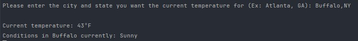

# Weather API Console Application

> Simple console application that makes an API call request to WeatherAPI.com



## Installation

Windows:

```sh
* Download zip file

* Unzip .zip file to desktop and open .csproj file in Visual Studio or other .NET IDE

* Get your API key from https://rapidapi.com and paste in the "ENTER RAPID API KEY HERE" section

* Build the solution

* Navigate to /bin/Debug(Release)/net6.0/

* Run the WeatherAPI.exe
```

## Release History

* 0.0.1
    * Initial Commit - Version 1

## Contributing

1. Fork it
2. Create your feature branch
3. Commit your changes
4. Push to the branch 
5. Create a new Pull Request
